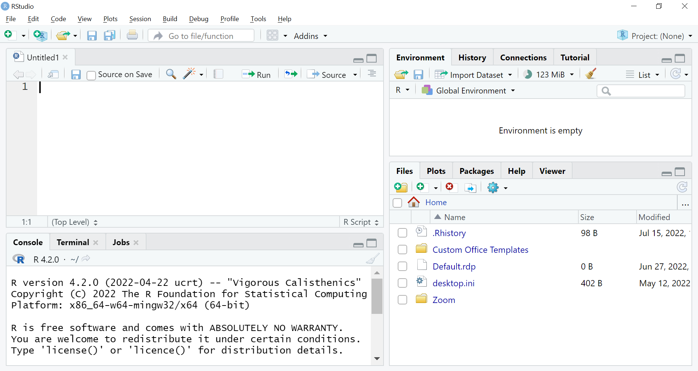

```{r setup, include=FALSE}
knitr::opts_chunk$set(echo = TRUE, comment = NA)

```

<br>

# This is R

## You Need Both R and RStudio Installed

If you only downloaded RStudio onto your computer it would not work. RStudio needs R to make it work.

<br>

When using a university computer in a cluster, use R and RStudio through AppsAnywhere. 

* Click the AppsAnywhere icon, scroll down to "Cran R" and click launch. 
* Once R has opened and downloaded onto the computer you can close it. 
* Now go back into Apps Anywhere to find RStudio and launch that.

<br>

You can try to download R and RStudio onto your own laptop in your own time.

* [Download and install the latest version of R](https://www.r-project.org/)
* [Download and install RStudio](https://www.rstudio.com/)

<br>

## Basic Layout

When you first open RStudio, you will see three panels:

  * The interactive R console (left)
  * Environment/History (tabbed in upper right)
  * Files/Plots/Packages/Help/Viewer (tabbed in lower right)

```{r, echo=FALSE, fig.alt="A screenshot of Rstudio showing eleven menus at the top left. One panel covers the left half with text about the R software. The right is divided into two panels with text saying that the environment is empty in the top panel and a display of the current file directory in the bottom panel."}
knitr::include_graphics("./images/RStudio_screenshot.png")
```

Once you open files, such as R scripts another panel will open in the top left.

* Click on the white square with the plus in green icon top left.

```{r,echo=FALSE, fig.alt="Two zoomed in screenshots of the top left menus in RStudio. The first screenshot shows a black rectangle highlighting an icon which is a white square with a plus inside a green circle. The second screenshot shows a black rectangle highlighting a menu item that reads R Script followed by the associated keyboard shortcut, Ctrl + Shift + N."}


```

<br>

## Working in RStudio
There are two main ways one can work within RStudio.

1. Test and play within the interactive R console (bottom left) 
2. Start writing in an .R file (script) and use RStudio's short cut keys to run the commands in the R console.
   * This is a great way to start; all your code is saved for later
   * You will be able to run the .R file (script) you create from within RStudio.

<br>

The first thing you will see in the R Console is a bunch
of information, followed by a ">" and a blinking cursor.  It operates by you typing in commands, R tries to execute them, and then returns a result.

<br>

The simplest thing you can do with R is use it as a calculator. Type the below into the script:

```{r}
1 + 100
```

<br>

:::: {.darkorchidbox data-latex=""}
::: {.center data-latex=""}
**Tip: Running segments of your code**
:::

To run a line of your script code in the R console, you can  
1. click on the <kbd>Run</kbd> button at the top right of the script, or  
2. hit <kbd>Ctrl</kbd>+<kbd>Return</kbd> in Windows or Linux or <kbd>&#8984;</kbd>+<kbd>Return</kbd> on MacOS.  
To run a block of code, select it and then <kbd>Run</kbd>.
::::

<br>

R will print out the answer, with a preceding `[1]`. Don't worry about this. Think of it as merely indicating what line the output is on.

If you type in an incomplete command, for example: 

~~~
> 1 +
~~~

R will show a `+` instead of a `>`. This means it's waiting for you to complete the command.  

If you want to cancel the command you can hit "Esc" and RStudio will give you back the ">" prompt.

<br>

## Functions

R has many built in functions (similar to excel functions). To call a function,
we can type its name, followed by open and closing parentheses.
Anything we type inside the parentheses is called the function's
arguments:

```{r}
log(15)  # natural logarithm
```
The text after each line of code is called a “comment”. Anything that follows after the hash symbol # is ignored by R when it executes code.

```{r}
sqrt(25) # square root
```

<br>

:::: {.darkorchidbox data-latex=""}
::: {.center data-latex=""}
**Tip**
:::

Don't worry about trying to remember every function in R. You
can Google them, or if you can remember the
start of a function's name, use the tab completion in RStudio.
::::

<br>

We can also do comparisons in R:

```{r}
1 == 1  # equality (note two equals signs, read as "is equal to")
```

```{r}
1 != 2  # inequality (read as "is not equal to")
```

```{r}
1 >= -9 # greater than or equal to
```

<br>

## Objects and assignment

We can store values in **objects** using the assignment operator `<-`, like this:

```{r}
x <- 1/40
```

Notice that assignment does not print a value. Instead, we stored the number for later
in the object `x`. `x` now contains the **value** `0.025`:

```{r}
x
```


<br>

Look for the `Environment` tab in one of the panes of RStudio, and you will see that `x` and its value
have appeared. Our object `x` can be used in place of a number in any calculation that expects a number:

```{r}
log(x)
```

Objects can be reassigned:

```{r}
x <- 100
```

`x` used to contain the value 0.025 and now it has the value 100.

Assignment values can contain the object being assigned to:

```{r}
x <- x + 1 # notice how RStudio updates its description of x on the top right tab
y <- x * 2
```

<br>

Object names are not limited to `x` and `y`. They can contain letters, numbers, underscores and periods. They must start with a letter. They
cannot start with a number, underscore nor contain spaces at all. Different people use
different conventions for long variable names, these include

  * periods.between.words
  * underscores\_between_words
  * camelCaseToSeparateWords

What you use is up to you, but **be consistent**.

```{r, echo=FALSE, fig.alt="A wound up snake with mouth open is beside the screaming_snake_case. A spread out snake has snake_case written on it. A camel with headphones on has camelCase written on it with the captial C in the space of it's hump. Colourful letters on a line spell out kebab-case"}
knitr::include_graphics("./images/coding_cases.png")
```
Artwork by @allison_horst

<br>

> **Challenge 1**
>
> Which of the following are valid R object names?
> ```{r, eval=FALSE}
> min_height
> max.height
> _age
> MaxLength
> min-length
> 2widths
> celsius2kelvin
> ```

<details>
  <summary>**Solution to Challenge 1**</summary>

The following can be used as R object names:
```{r ch1pt1-sol, eval=FALSE}
min_height
max.height
MaxLength
celsius2kelvin
```

The following will not be able to be used to create an object:
```{r ch1pt3-sol, eval=FALSE}
_age
min-length
2widths
```

</details>

<br>


One thing to be aware of is that R is *vectorized*, meaning that
objects and functions can have vectors as values. In contrast to physics and
mathematics, a vector in R describes a set of values in a certain order of the
same data type. For example:

```{r}
1:5
```

Assign this vector to the object `x`
```{r}
x <- 1:5
```

This is incredibly powerful as you will see:
```{r}
log(x)
```

<br>

> **Challenge 2**
>
> What will be the value of each object after each
> of these lines of code?
>
> ```{r, eval=FALSE}
> mass <- 40
> age <- 122
> mass <- mass * 2
> age <- age - 20
> ```

<details>
  <summary>**Solution to Challenge 2**</summary>

```{r ch2pt1-sol}
mass <- 40
```
This will give a value of `r mass` for the object mass

```{r ch2pt2-sol}
age <- 122
```
This will give a value of `r age` for the object age
```{r ch2pt3-sol}
mass <- mass * 2
```
This will multiply the existing value of `r mass/2` by 2 to give a new value of
`r mass` to the object mass.

```{r ch2pt4-sol}
age <- age - 20
```
This will subtract 20 from the existing value of `r age + 20 ` to give a new value of `r age` to the object age.
</details>

<br>

> **Challenge 3**
>
> If we ran this code
> ```{r, eval=FALSE}
> mass <- 40
> age <- 122
> ```
> What command would tell us if mass is greater than age?

<details>
  <summary>**Solution to Challenge 3**</summary>

One way of answering this question in R is to use the `>` to set up the following:
```{r ch3-sol}
mass > age
```
This should yield a boolean value of TRUE since `r mass` is greater than `r age`.
</details>

<br>

## Managing your environment

There are lots of useful commands you can use to interact with the R session.

`ls` will list all of the objects and functions stored in the global environment
(your working R session):

```{r, eval = FALSE}
ls()
```

Note here that we didn't give any arguments to `ls`, but we still
needed to give the parentheses to tell R to call the function.

If we type `ls` by itself, R prints a bunch of code instead of listing objects.

```{r}
ls
```

What going on here?
Like everything in R, `ls` is the name of an object, and entering the name of an object by itself prints the contents of the object. 

The object `x` that we created earlier contains 1,2,3,4,5:
```{r}
x
```

The object `ls` contains the R code that makes the `ls` function work!

<br>

`rm` deletes objects you no longer need:

```{r, eval=FALSE}
rm(x)
```

If you have lots of things in your environment and want to delete all of them,
you can **pass** the results of `ls` through the `rm` function:

```{r, eval=FALSE}
rm(list = ls())
```

Here we've combined two functions. Like the order of maths operations, anything
inside the innermost parentheses is evaluated first, and so on.

In this case we've specified that the results of `ls` should be used for the
`list` argument in `rm`. 

Note: When assigning values to arguments by name, you use the `=` operator.

If instead we use `<-`, there will be unintended side effects, or you may get an error message:

```{r, error=TRUE}
rm(list <- ls())
```

<br>

:::: {.darkorchidbox data-latex=""}
::: {.center data-latex=""}
**Tip: Warnings vs. Errors**
:::

Errors, like above, are thrown when R cannot proceed with a calculation. Warnings on the other hand usually mean that the function has run, but it probably hasn't worked as expected.  

In both cases, the message that R prints out can give you clues on how to fix a problem.
::::

<br>

## R Packages

It is possible to add functions to R by writing a package, or by
obtaining a package written by someone else. As of this writing, there
are over 18,000 packages available on CRAN (the comprehensive R archive
network). 

To install a package either:

* Type `install.packages("packagename")`,
  where `packagename` is the package name in quotes.
* Or, under the **Packages** tab, click **Install** and type the name of the package.

The package tab is where the packages already installed are listed.

Installing a package only needs doing once unless you change the computer you are working on. 

<br>

> **Challenge 4**
>
> Install the following packages: `ggplot2`, `dplyr`, `penguins`

<details>
  <summary>**Solution to Challenge 4**</summary>

We can use the `install.packages()` command to install the required packages.
```{r ch4-sol, eval=FALSE}
install.packages("ggplot2")
install.packages("dplyr")
install.packages("penguins")
```

An alternate solution, to install multiple packages with a single `install.packages()` command is:
```{r ch4-sol-alt, eval=FALSE}
install.packages(c("ggplot2", "dplyr", "penguins"))
```

Or you can use the **Packages** tab.
</details>

<br>

Even though a package only needs to be installed **once** onto your computer, a package needs to be `library` loaded  **everytime** you open up RStudio before you can use it.

* You can load a package and make it available for use with `library(packagename)`
* Or, under the **Packages** tab, click the empty check box next to a package name.

<br>

> **Challenge 5**
>
> Library load the following packages: `ggplot2`, `dplyr`, `penguins`

<details>
  <summary>**Solution to Challenge 5**</summary>

We can use the `library()` command to load the required packages.
```{r ch5-sol, eval=FALSE}
library(ggplot2)
library(dplyr)
library(penguins)
```

Or you can use the check boxes under the **Packages** tab.
</details>

<br>

<br>

[Source](https://github.com/acriach/r_teaching)  

Adapted from [R for Reproducible Scientific Analysis](https://swcarpentry.github.io/r-novice-gapminder/) licensed [CC_BY 4.0](https://creativecommons.org/licenses/by/4.0/) by [The Carpentries](https://carpentries.org/)