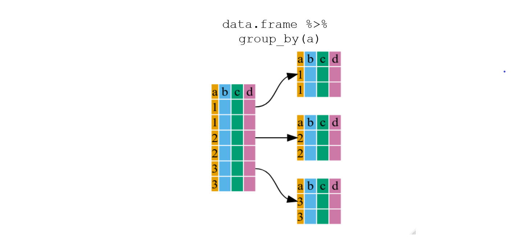
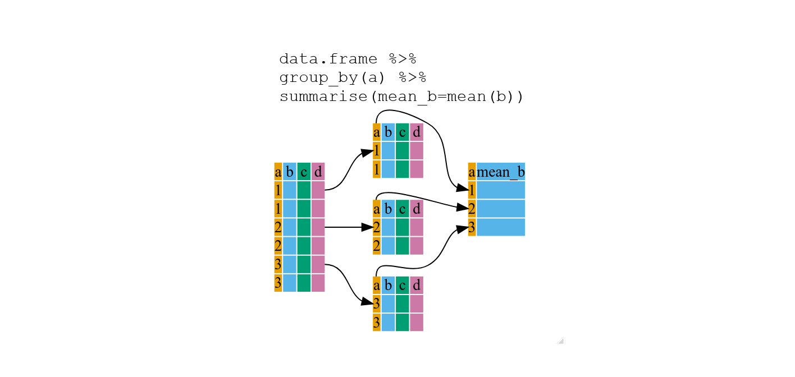

```{r setup, include=FALSE}
knitr::opts_chunk$set(echo = TRUE, eval = FALSE, warning = FALSE)
```

```{r, include=FALSE}
# Silently load in the data so the rest of the lesson works
penguins <- read.csv("data/penguins.csv", header=TRUE)
```


<br>

**Set up**

We will use the palmer penguin data so open your save Rproj in Rstudio by clicking **File** menu then **Open project** and look for your **.Rproj** file. Click the **Files** tab in bottom right pane, click the **data** folder and check the penguins.csv is in there. Then read it in.

```{r, eval = TRUE}
penguins <- read.csv(file = "data/penguins.csv")
```

<br>

# Data wrangling

```{r, echo=FALSE, eval = TRUE, fig.alt="Cartoon of a fuzzy monster with a cowboy hat and lasso, riding another fuzzy monster labeled “dplyr”, lassoing a group of angry / unruly looking creatures labeled “data”."}
knitr::include_graphics("./images/dplyr_wrangling.png")
```
Artwork by @allison_horst

Cleaning or wrangling data means many things to many researchers: we often
select certain observations (rows) or variables (columns), we often group the
data by a certain variable(s), or we even calculate summary statistics. We can
do these operations using the normal base R operations:

```{r}
mean(penguins[penguins$species == "Adelie", "body_mass_g"], na.rm = TRUE)
mean(penguins[penguins$species == "Gentoo", "body_mass_g"], na.rm = TRUE)
mean(penguins[penguins$species == "Chinstrap", "body_mass_g"])
```

But this isn't very *nice* because there is a fair bit of repetition. Repeating
yourself will cost you time, both now and later, and potentially introduce some
nasty bugs.

<br>

## The `dplyr` package
```{r, echo=FALSE, eval = TRUE, fig.alt="A hexagon with dplyr written in it and three colourful plyers on a space background"}
knitr::include_graphics("./images/dplyr_logo.png")
```

Luckily, the [`dplyr`](https://cran.r-project.org/package=dplyr)
package provides a number of very useful functions for manipulating dataframes
in a way that will reduce the above repetition, reduce the probability of making
errors, and probably even save you some typing. As an added bonus, you might
even find the `dplyr` grammar easier to understand.

Here we're going to cover 5 of the most commonly used functions as well as using
pipes (`%>%`) to combine them.

1. `select()`
2. `filter()`
3. `group_by()`
4. `summarize()`
5. `mutate()`

If you have have not installed this package earlier, please do so:

```{r,eval=FALSE}
install.packages('dplyr')
```

Now let's load the package:

```{r,message=FALSE, eval = TRUE}
library("dplyr")
```

<br>

## select()
```{r, echo=FALSE, eval = TRUE, fig.alt="Text is select(data.frame, a, c). On the right are four columns of data named a, b, c and d. On the left are two columns a and c. One arrow curves from a to a and the other arrow curves c to c."}
knitr::include_graphics("./images/dplyr-fig1.png")
```

If we wanted to analyse only a few of the variables (columns) in
our dataframe we could use the `select()` function. This will keep only the
variables you select.

```{r}
species_body <- select(penguins, species,body_mass_g,sex)
```

If we open up `species_body` (under the environment tab) we'll see that it only contains the species,
body mass and sex. Above we used 'normal' grammar, but the strengths of
`dplyr` lie in combining several functions using **pipes**. Since the pipes grammar
is unlike anything we've seen in R before, let's repeat what we've done above
using a pipe:

```{r}
species_body <- penguins %>% select(species, body_mass_g, sex)
```

First we assign the result to `species_bodymass`. Then, we call the penguins dataframe and pass it on, using the pipe
symbol `%>%`, to the next step, which is the `select()` function. this time
we don't specify which data object we use in the `select()` function since it
gets that from the previous pipe.

<br>

## filter()

If we now wanted to use the above, but only with Adelie penguins, we can combine `select` and `filter`

```{r}
species_body_adelie <- penguins %>%
    filter(species == "Adelie") %>%
    select(species, body_mass_g, sex)
```

:::: {.darkorchidbox data-latex=""}
::: {.center data-latex=""}
**Tip: select() and filter()**
:::

Remember, `select()` choose columns and `filter()` chooses rows 

::::

<br>

> **Challenge 1**
>
> Write a single command (which can span multiple lines and includes pipes) that
> will produce a dataframe that has the Gentoo values for `island`, `flipper_length_mm`
> and `year`, but not for other penguins.  How many rows does your dataframe
> have?

<details>
  <summary>**Solution to Challenge 1**</summary>

```{r, eval = TRUE}
gentoo_island_flipper_yr <- penguins %>%
    filter(species == "Gentoo") %>%
    select(island, flipper_length_mm, year)
```
You should have 124 rows.  

**Note:** The order of operations is very important in this
case. If we used 'select' first, filter would not be able to find the variable
species since we would have removed it in the previous step
</details>

<br>

## group_by() and summarize()

Now, we were supposed to be reducing the error prone repetitiveness of what can
be done with base R, but up to now we haven't done that since we would have to
repeat the above for each species. Using `filter()`, will only pass
observations that meet your criteria (in the above: `species=="Adelie"`). Instead, we
can use `group_by()`, which will analyse all three species.

```{r, echo=FALSE, eval = TRUE, fig.alt="Text is data.frame, pipe operator, group_by(a). On the right are four columns of data named a, b, c and d. Arrows show these rows split into three so 1 and 1 rows are in one dataframe, 2 and 2 rows in another and 3 and 3 rows together. "}

```

<br>

### Using group_by() with summarize()

`group_by()` is much more
exciting in conjunction with `summarize()`. By using the `group_by()` function, we split our
original data frame into multiple pieces, then we can run functions
(e.g. `mean()` or `sd()`) within `summarize()`.

```{r, echo=FALSE, eval = TRUE, fig.alt="Text is data.frame pipe operator group_by(a) pipe operator summarise(mean_b=mean(b)). On the right are four columns of data named a, b, c and d with six rows named 1,1,2,2,3 and 3 in column a. Arrows show these rows split so 1 and 1 rows are in one dataframe, 2 and 2 rows in another and 3 and 3 rows together. Three arrows goes from these 3 smaller dataframes to a final datafram with column a containing 1, 2 and 3 and a second column called mean_b."}

```

```{r, eval = TRUE}
penguins %>%
    group_by(species) %>%
    summarize(mean_body = mean(body_mass_g, na.rm=TRUE))
```

:::: {.darkorchidbox data-latex=""}
::: {.center data-latex=""}
**Tip: To assign or not**
:::

Starting the code with `species_body_means <-` will assign the results as a new data frame called `species_body_means`. This`species_body_means` will then be listed under the environment tab so you can view it. Good for large data frames. 

As above, you can choose not to do this for smaller results. The results are not saved but given in your console window.

::::

<br>

The function `group_by()` allows us to group by multiple variables. Let's group by `species` **and** `island`.

```{r, eval = FALSE}
penguins %>%
    group_by(species, sex) %>%
    summarize(mean_body = mean(body_mass_g, na.rm=TRUE))
```

<br>

You're not limited to analysing only one variable with only one function in `summarize()`.

```{r, message=FALSE, eval = FALSE}
penguins %>%
    group_by(species, sex) %>%
    summarize(mean_body = mean(body_mass_g),
              sd_body = sd(body_mass_g),
              mean_flipper = mean(flipper_length_mm),
              sd_flipper = sd(flipper_length_mm))
```

<br>

The `filter()` function can remove the penguins who have `NA` under sex. (Read the exclamation mark as "not")

```{r, message=FALSE, eval = FALSE}
penguins %>%
    group_by(species, sex) %>%
    filter(!is.na(sex)) %>%
    summarize(mean_body = mean(body_mass_g),
              sd_body = sd(body_mass_g),
              mean_flipper = mean(flipper_length_mm),
              sd_flipper = sd(flipper_length_mm))
```

<br>

> **Challenge 2**
>
> For each species and sex, calculate the mean and sd of bill length and bill depth.

<details>
  <summary>**Solution to Challenge 2**</summary>

```{r, message=FALSE}
penguins %>%
    group_by(species, sex) %>%
    filter(!is.na(sex)) %>%
    summarize(mean_billlength = mean(bill_length_mm),
              sd_billlength = sd(bill_length_mm),
              mean_billdepth = mean(bill_depth_mm),
              sd_billdepth = sd(bill_depth_mm))
```  
</details>

<br>

## count() and n()

If we wanted to check the number of penguins included in the
dataset for the year 2007, we can use `filter()` then the `count()` function:

```{r, eval = FALSE}
penguins %>%
    filter(year == 2007) %>%
    count
```

If we need to use the total number of observations in calculations, the `n()` function
is useful. For instance, if we wanted the standard error of body mass per species:

```{r, eval = FALSE}
penguins %>%
    group_by(species) %>%
    summarize(se_body = sd(body_mass_g)/sqrt(n()))
```

This works better if we filter out the NAs.
```{r}
penguins %>%
    group_by(species) %>%
    filter(!is.na(body_mass_g)) %>%
    summarize(se_body = sd(body_mass_g)/sqrt(n()))
```


:::: {.darkorchidbox data-latex=""}
::: {.center data-latex=""}
**Tip: Standard error**
:::

To calculate standard error (se), the standard deviation (sd) is divided by the square root of the sample size (n).
$se = sd/\sqrt n$

::::

<br>

## mutate()

```{r, echo=FALSE, eval = TRUE, fig.alt="Cartoon of cute fuzzy monsters dressed up as different X-men characters, working together to add a new column to an existing data frame. Stylized title text reads “dplyr::mutate - add columns, keep existing."}
knitr::include_graphics("./images/dplyr_mutate.png")
```
Artwork by @allison_horst

<br>

mutate() creates new variables(columns) from existing variables.

```{r}
penguins_body_kg <- penguins %>%
    mutate(body_weight_kg = body_mass_g / 1000)
```

<br>

### Connect mutate with case_when

We can combine
`mutate()` with `case_when()` to filter data in the moment of creating a new variable. (Note: case_when is an alternative to the older `ifelse()` function.)

```{r, echo=FALSE, fig.alt="Cartoon showing a table with creature type (kraken, dragon, or cyclops) and age (baby, teen, or adult). The three creatures listed are adding a new column named “danger”, which contains the word “extreme!” if the type is “kraken”, or “high” for any other type. Stylized text reads “dplyr::case_when() - IF ELSE...but you love it? An example of code is shown: mutate(danger = case_when(type == “kraken” ~ “extreme!”, TRUE ~ “high”)."}
knitr::include_graphics("./images/dplyr_case_when.png")
```

We can make a new column of data that categorises the Gentoo penguins as large and small and all other penguins as "not Gentoo". To do this we use information in the species and body mass columns.

```{r}
penguin_gentoo_bodysize <- penguins %>%
  mutate(
    size = case_when(
      species == "Gentoo" & body_mass_g >= 5000 ~ "large",
      species == "Gentoo" & body_mass_g < 5000 ~ "small",
      TRUE ~ "not Gentoo"
                    )
        )
```
 You can read `~` as "then write". The last line of code can be read as "if none of the conditions are TRUE then output is not Gentoo".

<br>

> **Advanced Challenge**
>
> Write code to select only the species, island, flipper length and sex variables. Filter to only the Adelie penguins. 
> Filter out the penguin with NA under flipper length. Group the data by island. Use mutate to create a new flipper
> length column in cm by dividing the flipper length by 100.
> Summarise the mean and sd of flipper lengths for each of the islands.

<details>
  <summary>**Solution to Advanced Challenge**</summary>

```{r, eval = TRUE}
penguins %>%
    select(species, island, flipper_length_mm, sex) %>%
    filter(species == "Adelie") %>%
    filter(!is.na(flipper_length_mm)) %>%
    group_by(island) %>%
    mutate(flipper_cm = flipper_length_mm/100) %>%
    summarise(flipper_mean_cm = mean(flipper_cm),
              flipper_sd = sd(flipper_cm))
    
```
</details>

<br>

## Other great resources

* [R for Data Science](http://r4ds.had.co.nz/)
* [Data Wrangling Cheat sheet](https://www.rstudio.com/wp-content/uploads/2015/02/data-wrangling-cheatsheet.pdf)
* [Introduction to dplyr](https://dplyr.tidyverse.org/)
* [Data wrangling with R and RStudio](https://www.rstudio.com/resources/webinars/data-wrangling-with-r-and-rstudio/)