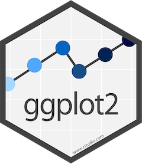

# Creating graphs

```{r setup, include=FALSE}
knitr::opts_chunk$set(echo = TRUE, eval = FALSE, warning = FALSE)
```

```{r, echo=FALSE, eval = TRUE, fig.alt="A fuzzy monster in a beret and scarf, critiquing their own column graph on a canvas in front of them while other assistant monsters (also in berets) carry over boxes full of elements that can be used to customize a graph (like themes and geometric shapes). In the background is a wall with framed data visualizations. Stylized text reads “ggplot2: build a data masterpiece."}
knitr::include_graphics("./images/ggplot2_masterpiece.png")
```

Artwork by @allison_horst

<br>

## Making graphs with ggplot2

**Set up**

We will use the palmer penguin data to make graphs.

<details>
  <summary>**How to open a saved Rproj and read in data if not already open**</summary>

Open your saved Rproj in Rstudio by clicking **File** menu then **Open project** and look for your **.Rproj** file. Click the **Files** tab in the bottom right pane, click the **data** folder and check the penguins.csv is in there. Then read it in.
```{r, eval = TRUE}
penguins <- read.csv(file = "data/penguins.csv")
```
</details>

<br>

There are different plotting systems in R for example,
the [base plotting system](http://www.sthda.com/english/wiki/r-base-graphs). But the function `ggplot` in the [ggplot2 package](https://r-graph-gallery.com/ggplot2-package.html#:~:text=ggplot2%20is%20a%20R%20package,almost%20any%20type%20of%20chart.) is used by the majority of people.

To use it you will need to ensure you have the ggplot2 package installed. Hint: you could use the Packages tab, bottom right and then load it using the function `library()`.
```{r, eval = TRUE}
library(ggplot2)
```


```{r, echo=FALSE, eval = TRUE, fig.alt="A hexagon with ggplot written in it and a zig zag line from left to right with some circles"}

```

ggplot2 is built on the idea that any plot can be
made from the same set of components: a **data** set, a
**mapping**, and some **geoms**.

The key to understanding ggplot2 is to think about a graph in layers.

Let's start off with an example:

```{r bodyMassflipperLength-scatter, message=FALSE}
ggplot(data = penguins, mapping = aes(x = body_mass_g, y = flipper_length_mm)) +
  geom_point()
```

In the command we call the `ggplot` function. Any of the arguments we give the
`ggplot` function in the brackets following, will apply to all
layers on the plot.  

We've passed in two arguments to `ggplot`. First, we tell `ggplot` what data we
want to use to make the figure. In this example, that is the penguins data we read in
earlier.   

For the second argument called mapping,  we passed in the `aes` function, which
tells `ggplot` how variables in the **data** map to **aesthetic** properties of
the figure. In this case the **x** and **y** locations. Here we told `ggplot` we
want to plot the "body mass" column of the penguins data frame on the x-axis, and
the "flipper length" column on the y-axis. 

By itself, the call to `ggplot` isn't enough to draw a figure:

```{r nogeom}
ggplot(data = penguins, mapping = aes(x = body_mass_g, y = flipper_length_mm))
```

We need to tell `ggplot` how we want to visually represent the data, which we
do by adding a **geom** layer. In our example, we used `geom_point`, which
tells `ggplot` we want to visually represent the relationship between **x** and
**y** as a scatterplot of points:

```{r bodyMass-vs-flipperLength-scatter, message=FALSE, eval = TRUE}
ggplot(data = penguins, mapping = aes(x = body_mass_g, y = flipper_length_mm)) +
  geom_point()
```

<br>

> **Challenge 1**
>
> Modify the example so that the figure shows how **bill length** relates to flipper length:
>
> ```{r, eval=FALSE}
> ggplot(data = penguins, mapping = aes(x = body_mass_g, y = flipper_length_mm)) + 
    geom_point()
> ```

<details>
  <summary>**Solution to Challenge 1**</summary>

Here is one possible solution:
```{r, eval = TRUE}
ggplot(data = penguins, mapping = aes(x = bill_length_mm, y = flipper_length_mm)) + 
  geom_point()
```

Note: we can add arguments to geom_point to control the size, transparency and shape of the points.
```{r, eval = TRUE}
ggplot(data = penguins, mapping = aes(x = bill_length_mm, y = flipper_length_mm)) + 
  geom_point(size = 5, alpha = 0.5, shape = "diamond")
```
</details>

<br>

> **Challenge 2**
>
> So far we've used the `aes` function to tell
> the scatterplot **geom** about the **x** and **y** locations of each point.
> Another aesthetic property we can modify is **colour**. Add a `colour=` argument to the aes brackets
> to **colour** the points according to the "species" column.

<details>
  <summary>**Solution to Challenge 2**</summary>

Here is one possible solution:
```{r, eval = TRUE}
ggplot(data = penguins, mapping = aes(x = bill_length_mm, y = flipper_length_mm, colour = species)) + 
  geom_point()
```
</details>

<br>

We can make other types of graph using other **geoms**. If we wanted to compare body mass among the penguin species we might use a boxplot. We can change the `geom` to do this:

```{r bodyMassSpecies, eval = TRUE}
ggplot(data = penguins, mapping = aes(x = species, y = body_mass_g)) + 
  geom_boxplot()
```

:::: {.darkorchidbox data-latex=""}
::: {.center data-latex=""}
**Tip: ggplot cheat sheet**
:::

There is a <kbd>[ggplot cheat sheet](https://raw.githubusercontent.com/rstudio/cheatsheets/main/data-visualization.pdf)</kbd> to download which you can look at to see what the geoms are for common types of graph, as well as other ggplot code.  

Note that the layers on the cheat sheet have single letters and a <kbd>+</kbd> to represent the rest of the code for the graph. 
::::

<br>

## Layers

If we want boxplots with data points on top to visualise the spread of the data, we can
add another layer to the plot. `geom_jitter()` is good for this because it does not plot the points in one vertical line but randomly spreads them out:

```{r boxplotJitter}
ggplot(data = penguins, mapping = aes(x = species, y = body_mass_g)) + 
  geom_boxplot() +
  geom_jitter()
```

<br>

More layers can be added to control the way a graph looks. For example, we can change the axes labels:
```{r boxplotLabs}
ggplot(data = penguins, mapping = aes(x = species, y = body_mass_g)) + 
  geom_boxplot() +
  geom_jitter() +
  labs(x = "Species",
       y = "Body Mass (g)")
```

<br>

We could use lots of layers to control the background, gridlines, axis lines. However, using a theme instead does this in one layer. `theme_classic()` gives styling that might be found in a scientific journal.
```{r boxplotPoints}
ggplot(data = penguins, mapping = aes(x = species, y = body_mass_g)) + 
  geom_boxplot() +
  geom_jitter() +
  labs(x = "Species",
       y = "Body Mass (g)") +
  theme_classic()
```

<br>

> **Challenge 3**
>
> Create a ggplot graph using the `geom_violin()` which shows the difference in **bill length** among the **sexes**. Add layers for axes labels and theme styling. 

<details>
  <summary>**What the Challenge 3 graph might look like**</summary>

```{r, eval = TRUE, echo = FALSE}
ggplot(data = penguins, mapping = aes(x = sex, y = bill_length_mm)) + 
  geom_violin() +
  labs(x = "Sex",
       y = "Bill Length (mm)") +
  theme_classic()
```

Note: when we learn about data wrangling we will go through ways of removing data points such as the penguins that had NA under sex.
</details>  

<br>

## Colour

We previously used colour in aes to give each species a different colour:
```{r}
ggplot(data = penguins, mapping = aes(x = bill_length_mm, y = flipper_length_mm, colour = species)) + 
  geom_point()
```

Putting the `colour = species` in the aes function in the **geom** layer also works:
```{r}
ggplot(data = penguins, mapping = aes(x = bill_length_mm, y = flipper_length_mm)) + 
  geom_point(aes(colour = species))
```

However, if we want to specify that all points should be a blue colour, oppose to levels in a variable being different colours, we use `colour =` but **outside** of the `aes` brackets:
```{r}
ggplot(data = penguins, mapping = aes(x = bill_length_mm, y = flipper_length_mm)) + 
  geom_point(colour = "blue")
```
Note the word blue is put in "speech marks".

<br>

> **Challenge 4**
>
> Choose a colour from this 
> [website that lists R colours](https://www.datanovia.com/en/blog/awesome-list-of-657-r-color-names/) 
> and create a **violin plot** outlined in that colour which shows the difference in **body mass** among **species**. You can 
> include layers for axes labels and styling. 

<details>
  <summary>**What the Challenge 4 graph might look like**</summary>

```{r, eval = TRUE, echo=FALSE}
ggplot(data = penguins, mapping = aes(x = species, y = body_mass_g)) + 
  geom_violin(colour = "darkorchid")
```

Note: adding `fill = "darkorange"` will add a colour to the inside of the violin.
```{r, eval = TRUE, echo = FALSE}
ggplot(data = penguins, mapping = aes(x = species, y = body_mass_g)) + 
  geom_violin(colour = "darkorchid", fill = "darkorange")
```
</details>  

<br>

<br>

This graph uses default colours:
```{r}
ggplot(data = penguins, mapping = aes(x = bill_length_mm, y = flipper_length_mm, colour = species)) + 
  geom_point() +
  labs(x = "Bill Length (mm)",
       y = "Flipper Length (mm)") +
  theme_classic()
```

But to specify colours you need to use `scale_colour_manual`. 

> **Challenge 5**
> Adapt your code to add a scale_colour_manual layer with the colours darkorange, purple and cyan4 to create the graph below.

```{r, eval = TRUE, echo = FALSE}
ggplot(data = penguins, mapping = aes(x = bill_length_mm, y = flipper_length_mm, colour = species)) + 
  geom_point() +
  labs(x = "Bill Length (mm)",
       y = "Flipper Length (mm)") +
  theme_classic() +
  scale_colour_manual(values = c("darkorange","purple","cyan4"))
```

<br>

:::: {.darkorchidbox data-latex=""}
::: {.center data-latex=""}
**Tip: creating plots**
:::

If searching for ggplot layers that will control specific parts of your graph, using the correct graph terminology helps. For example, tick marks, levels, error bars, axes, legends.

If code is not working, try running it repeatedly without different layers in turn to identify which layer is the problem.
::::

<br>

## Plotting statistics

ggplot2 makes it easy to overlay statistical models represented by a trend line on a graph by adding a `geom_smooth` layer:
```{r billflipper, message=FALSE}
ggplot(data = penguins, mapping = aes(x = bill_length_mm, y = bill_depth_mm)) + 
  geom_point() +
  geom_smooth(method="lm")
```
Note: the `lm` stands for linear model and is the function used to run a linear regression.

We can also do this after the data has been split by **species** using `group`:
```{r billflippergroup, message=FALSE}
ggplot(data = penguins, mapping = aes(x = bill_length_mm, y = bill_depth_mm, group = species)) + 
  geom_point() +
  geom_smooth(method="lm")
```

<br>

> **Challenge 6**
>
> Make a **scatterplot** of **bill length** and **bill depth**, grouped and coloured by **species**, with **trendlines** for each species and **triangles** for points and **specify colours** (you can choose colours). Give it appropriate axes **labels** and a **classic theme**.
 

<details>
  <summary>**What the Challenge 6 graph might look like**</summary>

Here is one possible solution:
```{r, eval = TRUE, echo = FALSE, message=FALSE}
ggplot(data = penguins, mapping = aes(x = bill_length_mm, y = bill_depth_mm, colour = species, grouped = species)) + 
  geom_point(shape = "triangle") +
  labs(x = "Bill Length (mm)",
       y = "Bill Depth (mm)") +
  theme_classic() +
  scale_colour_manual(values = c("darkorange","purple","cyan4")) +
  geom_smooth(method = lm)
```
</details>

<br>

## Exporting plots

The `ggsave()` function allows you to export a plot created with ggplot so you can paste it into word. You can specify the dimension and resolution of your plot by adjusting the appropriate arguments (`width`, `height` and `dpi`) to create high quality graphics for your assessments.  
In order to save a plot from above, we first assign it to an object, we could call it `penguin_plot`:

```{r save}
penguin_plot <- ggplot(data = penguins, mapping = aes(x = bill_length_mm, y = bill_depth_mm, colour = species, grouped = species)) + 
  geom_point(shape = "triangle") +
  labs(x = "Bill Length (mm)",
       y = "Bill Depth (mm)") +
  theme_classic() +
  scale_colour_manual(values = c("darkorange","purple","cyan4")) +
  geom_smooth(method = lm)
```

Now we can tell `ggsave` to save that plot in our `results` folder, with the file name "billScatterplot", in `png` format and specify the width and height in cm and the resolution (dpi). Check you have a `results` folder in your working directory by clicking the files tab in the bottom left pane.

```{r, eval=FALSE}
ggsave(filename = "results/billScatterplot.png", plot = penguin_plot, width = 12, height = 10, dpi = 300, units = "cm")
```

<br>

<br>

[Source](https://github.com/acriach/r_teaching) 

Adapted from [R for Reproducible Scientific Analysis](https://swcarpentry.github.io/r-novice-gapminder/) licensed [CC_BY 4.0](https://creativecommons.org/licenses/by/4.0/) by [The Carpentries](https://carpentries.org/)
