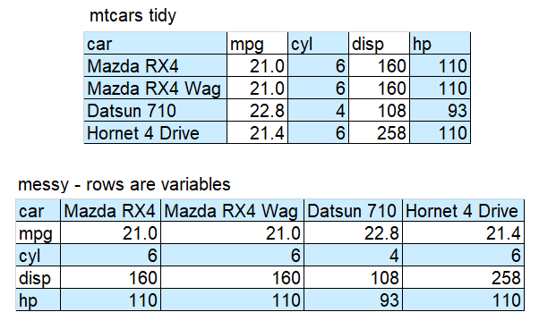
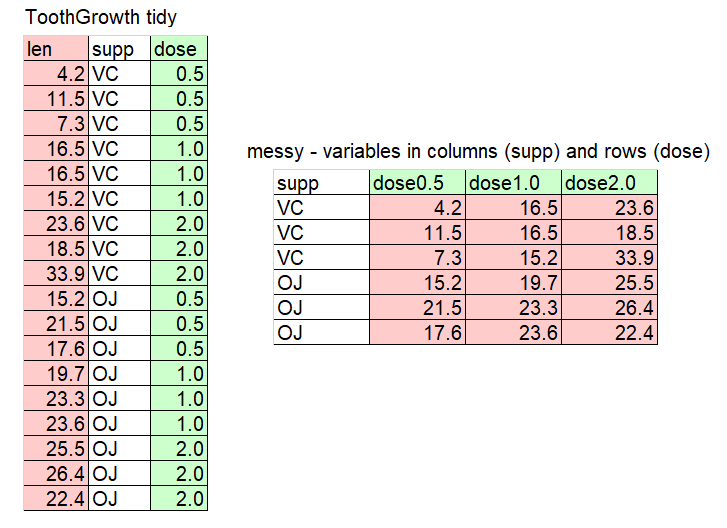
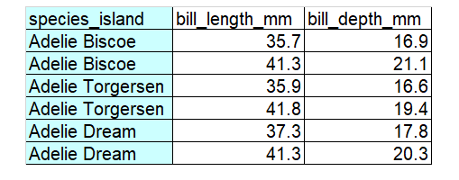
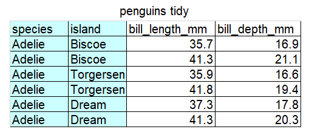

```{r setup, include=FALSE}
knitr::opts_chunk$set(echo = TRUE, eval = FALSE, warning = FALSE)
```

```{r, include=FALSE}
# Silently load in the data so the rest of the lesson works
penguins <- read.csv("data/penguins.csv", header=TRUE)
```

**set up**

To use the `tidyr` package you will need to ensure you have it installed on the computer you are using (hint: use the Packages tab, bottom right) and then load it.
```{r, eval = TRUE}
library(tidyr)
```

<br>

# Tidy Data

The same data can be laid out in a spreadsheet in a number of different ways.

"Tidy" data has a layout that makes it easier to do analyses in R. Real data is rarely in the format you need for analysis and often needs to be changed.

```{r, echo=FALSE, eval = TRUE, fig.alt="Stylized text providing an overview of Tidy Data. The top reads “Tidy data is a standard way of mapping the meaning of a dataset to its structure. - Hadley Wickham.” On the left reads “In tidy data: each variable forms a column; each observation forms a row; each cell is a single measurement.” There is an example table on the lower right with columns ‘id’, ‘name’ and ‘color’ with observations for different cats, illustrating tidy data structure.”."}
knitr::include_graphics("./images/tidydata_quote.jpg")
```
Artwork by @allison_horst

<br>

## Examples

Study the cartoon and the tables to understand what tidy data is.
```{r, echo=FALSE, eval = TRUE, fig.alt="There are two sets of anthropomorphized data tables. The top group of three tables are all rectangular and smiling, with a shared speech bubble reading “our columns are variables and our rows are observations!”. Text to the left of that group reads “The standard structure of tidy data means that “tidy datasets are all alike…” The lower group of four tables are all different shapes, look ragged and concerned, and have different speech bubbles reading (from left to right) “my column are values and my rows are variables”, “I have variables in columns AND in rows”, “I have multiple variables in a single column”, and “I don’t even KNOW what my deal is.” Next to the frazzled data tables is text “...but every messy dataset is messy in its own way. -Hadley Wickham.”."}
knitr::include_graphics("./images/tidydata_messy.jpg")
```

```{r, echo=FALSE, eval = TRUE, fig.alt="The text above the first table is “mtcars tidy”. The first table has the column names car, mpg, cyl, disp and hp and 4 rows of data. The data in the first column is Mazda RX4, Mazda RX4 Wag, Datsun 710 and Hornet 4 Drive. The second table has “messy - rows are variables” and is a pivoted (transposed) version of the first table with the column names as Mazda RX4, Mazda RX4 Wag, Datsun 710 and Hornet 4 Drive."}

```

```{r, echo=FALSE, eval = TRUE, fig.alt="The text above the first table is “iris tidy”. The first table has the column names Petal.Length, Petal.Width and Species and 3 rows of data. The second table has “messy - multiple variables (petal length and petal width) in single column” and the first column Petal.Dimension has alternative LEngth and Width rows with the next column with the measurements in it"}
knitr::include_graphics("./images/iris_messy.png")
```

```{r, echo=FALSE, eval = TRUE, fig.alt="The text above the first table is “ToothGrowth tidy”. The first table has the column names len, supp and dose and 18 rows of data. The second table has “messy - variables in columns (supp) and rows(dose)” and the first column supp has a variable but the next three columns are named dose0.5, dose, 1.0 and dose2.0 and all contain len measurements."}

```

:::: {.darkorchidbox data-latex=""}
::: {.center data-latex=""}

**Tip: Example data**
:::

This data is sampled from datasets (mtcars, iris, ToothGrowth) commonly used on R internet help forums. Being familiar with the column names helps you to understand where the variables should go when you adapt example code.
::::

<br>

> **Challenge 1**
>
> Decide if this data is tidy or messy. Explain why. 

```{r, echo = FALSE, eval= TRUE, fig.alt = "The table has the text “messy - multiple variable (species an island) in single column” and > is a table with the first column names species_island and that first column has Adelie and Biscoe in the same cell."}

```

<details>
  <summary>**Solution to Challenge 1**</summary>

The data is messy because there are two variables (species and island) in a single column. In other words, there are two observations in each of the cells in the first column. The corresponding tidy version is below.
```{r, echo=FALSE, eval = TRUE, fig.alt="The text above the table is “penguins tidy”. It has the column names species, island, bill_length_mm and bill_depth_mm."}

```
</details>

<br>

## separate()
Since "...every messy dataset is messy in it's own way" there are many functions you might need to change data. `separate()` is just one example.

To demonstrate `separate()` we will first create the messy data set in the Challenge above using the combine `c()` function. (In internet help forums you may see small example data frames (df) created in this way.)

```{r, echo = TRUE, eval=TRUE}
penguin_messy_df <- data.frame(
  species_island = c(rep("Adelie Biscoe", 2), rep("Adelie Torgersen", 2), rep("Adelie Cream", 2)), # `rep()` is the repeat function. 
  bill_length_mm = c(35.7, 41.3, 35.9, 41.8, 37.3, 41.3),
  bill_depth_mm = c(16.9, 21.1, 16.6, 19.4, 17.8, 20.3)
)
```

If you run this code for yourself you can view the data frame under the environment tab.

Now we can use `separate()` to split the `species_island` column into two columns and create a new data frame called `penguin_tidy_df`.
```{r, eval = TRUE}
penguin_tidy_df <- separate(
  penguin_messy_df, # the data frame we want to change
  col = species_island, # the column we want separated
  into = c('species', 'island'), # the names of the new columns we want to create
  sep = ' ') # what separates the data. In our case a space
```
View `penguin_tidy_df` to make sure it's worked.

<br>

## long and wide data

Another way you may need to change data is by making it "longer" or "wider" using the functions `pivot_longer()` and `pivot_wider()`. Study the examples below so you understand the difference between the two data formats.

<br>

### pivot_wider

This code creates a small data frame in long format:
```{r, echo = TRUE, eval = TRUE}
population_long <- data.frame(
  country = c(rep("Chad", 2), rep("Cuba", 2), rep("Fiji", 2), rep("Iran", 2)),
  year = rep(c(2000, 2020), 4),
  population = c(9755000, 16818391, 11269000, 11113215, 848000, 898402, 69515000, 85655490)
)
population_long
```

The function `pivot_wider()` is used to make each **year** a **new column**, with the values under **population** used to **fill** the new columns:
```{r}
population_wide <- pivot_wider(population_long, # the data frame to be made wider
                               names_from = year, # column to take the names for the new columns from
                               values_from = population, # the column to take values from to fill in the new columns
                               )
```

<br>

### pivot_longer

This code, which creates a small data frame in wide format, shows fish weights before and after a treatment:
```{r, echo = TRUE, eval = TRUE}
fish_wide <- data.frame(
  fish = c(1:4),
  before = c(12.4, 12.9, 11.2, 10.8),
  after = c(13.1, 13.2, 12.3, 11.7)
)
fish_wide
```

The function `pivot_longer()` is used to take the headings **before** and **after** and repeat in a column named **time** and put the **measurements** in a new column called **weights**:
```{r, echo=TRUE}
pivot_longer(fish_wide, 
  cols = c(before, after), # columns to pivot from wide to long
  names_to = "time", # name of the new column for the categories
  values_to = "weight" # name of the new column where the values go
)
```

<br>

> **Challenge 2**
>
> Use the code to create a wide data set containing the height of four people as children and adults. 
> Use pivot_longer to make the data long. You can reveal the **Hint** if you need to.

```{r, echo=TRUE, eval=TRUE}
people_heights_wide <- data.frame(
  person = 1:4,
  child = c(85.4, 79.1, 81.9, 90.1),
  adult = c(170.1, 165.9, 168.8, 183.7)
)
```


<details>
  <summary>**Hint**</summary>

The columns to pivot are child and adult.
The name of the new column could be "age"
The name of the new column for the measurements could be "height"
</details>

<br>

<details>
  <summary>**Solution to Challenge 2**</summary>

```{r, echo=TRUE, eval = TRUE}
pivot_longer(people_heights_wide, 
  cols = c(child, adult),    
  names_to = "age", 
  values_to = "height"
)
```
</details>

<br>

:::: {.darkorchidbox data-latex=""}
::: {.center data-latex=""}

**Tip: Collecting data**
:::

These are small, simple examples. Real data can be difficult to change.

If you are collecting your own data, plan in detail how the data will be analysed so that as you record data you arrange it in your spreadsheet in a way that will make data wrangling and analysis easier. 
::::
